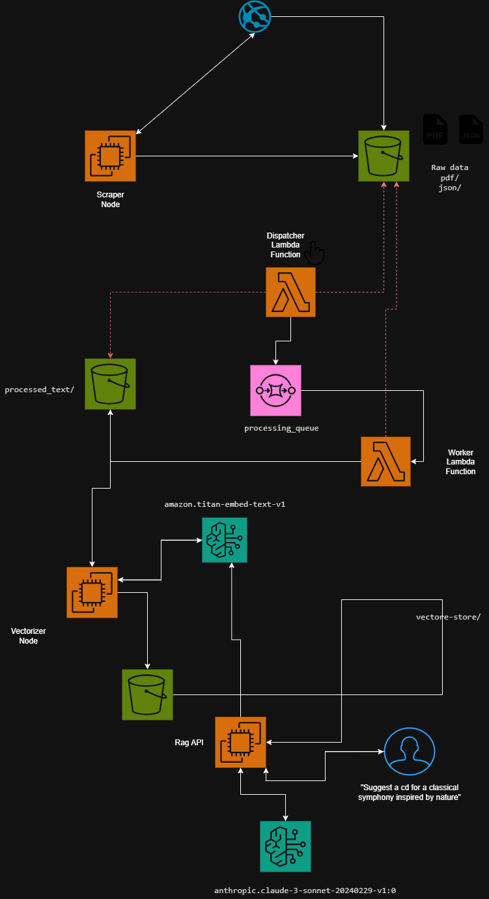

# CDiscover-AI: A Context-Aware Classical Music Discovery Engine

**A sophisticated, end-to-end RAG (Retrieval-Augmented Generation) system designed to provide nuanced, context-aware classical music recommendations by understanding the rich, descriptive text within thousands of expert-written CD liner notes.**

This project moves beyond shallow metadata (e.g., composer, title) to answer subjective user queries like *"Find me a recording of Baroque music that conveys a sense of grandeur and ceremonial dignity"* or *"Suggest some mysterious music for solo piano."*

## The Vision & Problem Statement

Standard classical music recommendation systems often fail because they rely on simple tags. They can find you *Beethoven's 5th Symphony*, but they can't answer *why* you should listen to a particular recording or what emotional journey it will take you on.

The real expertise lies in the thousands of pages of liner notes written by musicologists—an underutilized source of high-quality data. This project leverages this data to create a true "Discovery Engine" that understands not just *what* a piece of music is, but *what it feels like*.

The core technical goal was to build this system in a **cost-optimized** manner, using foundational AWS services and avoiding expensive, proprietary vector databases.

## Architecture & Technical Stack

This project is a complete, cloud-native application deployed on AWS and managed entirely with Infrastructure as Code (IaC) via Terraform. The architecture is a scalable, event-driven pipeline designed for data processing, vectorization, and serving a live API.

### The Data Pipeline Explained

The system is broken down into distinct, logical stages:

1.  **Scraping (EC2):** A Python script using `requests` and `BeautifulSoup` runs on a dedicated EC2 instance. It systematically scrapes album data and liner notes from over 4,000 pages on the Hyperion Records website. It intelligently handles different page layouts and downloads PDF booklets when HTML notes are unavailable. The raw data (JSON metadata and PDF files) is stored in an S3 bucket.

2.  **Pre-processing (Lambda & SQS):** An event-driven workflow using SQS and Lambda processes the raw data. The Lambda function reads the JSON and PDF files, cleans the text, aggregates the content, and saves it as structured `.txt` files in a separate S3 prefix, ready for vectorization.

3.  **Vectorization (EC2):** A dedicated EC2 instance runs a batch vectorization script. It reads the cleaned texts, computes embeddings using the `amazon.titan-embed-text-v1` model via Bedrock, and stores the final vectors and metadata as partitioned Parquet files in S3. This cost-effective "roll your own" vector store avoids the overhead of managed databases like Pinecone or Elasticsearch.

4.  **API Serving (EC2):** A separate EC2 instance runs a Flask-based RAG API. On startup, it loads the vector database from S3 into memory. It exposes an endpoint that takes a user query, generates an embedding, performs a cosine similarity search, and uses the retrieved context to generate a high-quality recommendation with `anthropic.claude-3-sonnet-20240229-v1:0` on Bedrock.

### Tech Stack

*   **Cloud & IaC:** AWS, Terraform
*   **Core Services:** S3, EC2, Lambda, SQS, IAM, VPC
*   **AI/ML:** Amazon Bedrock (Titan for Embeddings, Claude 3 Sonnet for Generation)
*   **Backend & Data:** Python, Flask, Pandas, NumPy